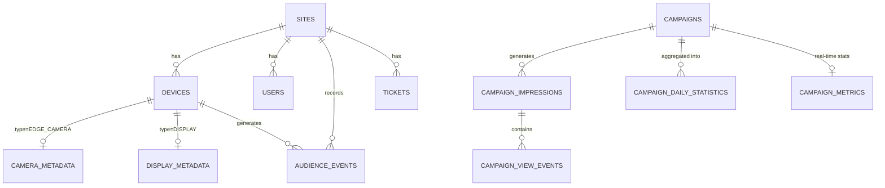

# 07 - Base de Données

Le système IAD & SmartQueue AI utilise **PostgreSQL** comme SGBD principal. Une extension **TimescaleDB** est utilisée spécifiquement pour la gestion des hyper-tables de séries temporelles (ex: les `audience_events` massifs).

L'interaction entre l'application backend et PostgreSQL se fait via **Prisma ORM**, garantissant une cohérence stricte des types et facilitant les migrations de schéma.

## 7.1 Schéma de la Base de Données (Aperçu)

| Table | Description |
| ----- | ----------- |
| `sites` | Représente les lieux physiques (ex: magasins). Contient les seuils d'alertes. |
| `devices` | Flotte d'appareils physiques (Caméras, Kiosques). Lié à un site. |
| `camera_metadata` | Configuration spécifique aux caméras (FPS, modèle, zone, Stream URL). |
| `display_metadata` | Configuration spécifique aux écrans (Résolution, Playlist, Campagne active). |
| `users` | Comptes utilisateurs (Admin, Manager, Agent) avec authentification. |
| `campaigns` | Configuration des campagnes publicitaires et de leur ciblage. |
| `audience_events` | Table volumineuse de séries temporelles stockant les rapports IoT réguliers (densité, compte). |
| `campaign_impressions` | Trace chaque fois qu'une campagne est lue sur un écran (Display). |
| `campaign_view_events` | Capture d'attention (Dwell Time) individuelle liée à une `impression`. |
| `campaign_daily_statistics` | Agrégation quotidienne calculée par CRON (Score, temps de vue moyen). |
| `tickets` | Système de file d'attente. |
| `ml_models` | Registre des versions de modèles de Machine Learning. |
| `system_settings` | Configuration technique globale (Singleton JSON). |

## 7.2 Diagramme Entité-Relation (ERD)

*Voir également [diagrams/database.md](diagrams/database.md) pour le code Mermaid.*

## 7.3 Tables Principales Détaillées

### `devices`
| Colonne | Type | Null | Clé | Description |
| ------- | ---- | ---- | --- | ----------- |
| `id` | Uuid | Non | PK | Identifiant interne |
| `deviceId` | String | Non | UNIQUE | Identité persistante du matériel (MAC ou Serial) |
| `type` | Enum | Non | Index | `DISPLAY`, `EDGE_CAMERA`, etc. |
| `siteId` | Uuid | Oui | FK | Référence vers `sites`. Null = non appairé |
| `status` | Enum | Non | Index | `UNPAIRED`, `ONLINE`, `WARNING`, `OFFLINE` |
| `lastHeartbeat` | DateTime | Oui | - | Utilisé pour déterminer le statut `ONLINE` |

### `audience_events` (Hypertable probable)
| Colonne | Type | Null | Clé | Description |
| ------- | ---- | ---- | --- | ----------- |
| `id` | Uuid | Non | PK | UUID généré |
| `timestamp` | DateTime | Non | PK, Index| Horodatage de l'événement |
| `siteId` | Uuid | Non | FK, Index | Lieu physique |
| `deviceId` | Uuid | Non | FK, Index | Caméra ayant remonté l'événement |
| `peopleCount` | Int | Non | - | Nombre total de personnes |
| `densityScore`| Float | Non | - | Score de densité calculé |
| `youngCount` | Int | Non | - | Décompte tranche d'âge "Jeune" |

### `campaigns`
| Colonne | Type | Null | Clé | Description |
| ------- | ---- | ---- | --- | ----------- |
| `id` | Uuid | Non | PK | Identifiant de campagne |
| `mediaUrl` | String | Non | - | Chemin dans MinIO |
| `duration` | Int | Non | - | Durée de lecture en secondes |
| `targetAudience` | Json | Non | - | Filtres et ciblages (JSON) |

## 7.4 Migrations

Les migrations de base de données sont gérées nativement par Prisma ORM.
Le répertoire `apps/backend/prisma/migrations/` contient l'historique SQL des changements de schéma, garantissant des déploiements reproductibles sur chaque environnement.
