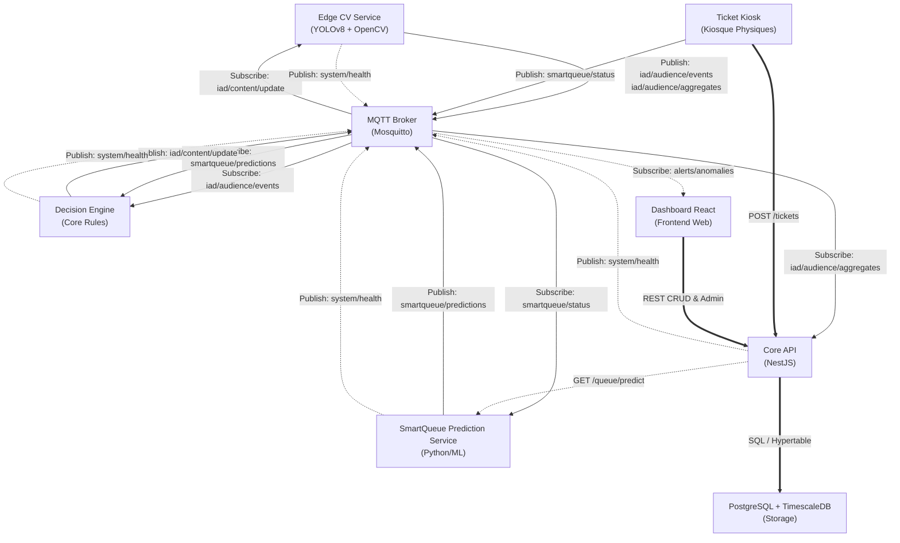

# Contrat d'Interface Technique (T-001) - IAD & SmartQueue AI

Ce document définit de manière exhaustive les contrats d'interface, les protocoles de communication, les schémas de données et les conventions techniques pour le projet **IAD & SmartQueue AI** d'Express Display. Il fait office de contrat officiel de référence pour toutes les équipes de développement (Edge CV, Backend, Kiosque, Dashboard).

---

## 1. Vue d'ensemble de l'architecture des échanges

Le diagramme ci-dessous illustre l'architecture des flux de communication entre les différents services via les protocoles MQTT (temps réel) et REST HTTP (CRUD / requêtes transactionnelles).



---

## 2. Contrat MQTT

Tous les échanges MQTT respectent le format JSON, utilisent des timestamps au format ISO 8601 UTC, et ont une structure normalisée.

### 2.1. Topic : `iad/audience/events`

*   **Description** : Événements bruts de détection d'audience (passage d'une personne devant un écran) en temps réel.
*   **Publisher** : Edge CV Service
*   **Subscriber** : Decision Engine, Core API
*   **QoS recommandé** : `1` (At least once) pour s'assurer qu'aucun événement d'audience n'est manqué.
*   **Validation du payload** :
    *   `event_id`: String (UUID v4)
    *   `device_id`: String (UUID v4)
    *   `timestamp`: String (Format ISO 8601 UTC)
    *   `duration_seconds`: Number (Strictement positif)
    *   `demographics`: Object contenant `age_group` (enum: `'child'`, `'young_adult'`, `'adult'`, `'senior'`) et `gender` (enum: `'male'`, `'female'`, `'unknown'`)
    *   `attention_score`: Number (Flottant entre `0.0` et `1.0`)

*   **Exemple JSON complet** :
```json
{
  "event_id": "9b1deb4d-3b7d-4bad-9bdd-2b0d7b3dcb6d",
  "device_id": "1a2b3c4d-5e6f-7a8b-9c0d-1e2f3a4b5c6d",
  "timestamp": "2026-06-24T18:44:30.123Z",
  "duration_seconds": 4.5,
  "demographics": {
    "age_group": "adult",
    "gender": "male"
  },
  "attention_score": 0.85
}
```

### 2.2. Topic : `iad/audience/aggregates`

*   **Description** : Agrégations périodiques d'audience (généralement toutes les minutes) envoyées par les caméras locales.
*   **Publisher** : Edge CV Service
*   **Subscriber** : Core API (pour stockage dans TimescaleDB), Dashboard React
*   **QoS recommandé** : `0` (At most once) car la perte ponctuelle d'un paquet agrégé n'affecte pas gravement les statistiques à long terme.
*   **Validation du payload** :
    *   `aggregate_id`: String (UUID v4)
    *   `device_id`: String (UUID v4)
    *   `interval_start`: String (ISO 8601 UTC)
    *   `interval_end`: String (ISO 8601 UTC)
    *   `total_viewer_count`: Integer (>= 0)
    *   `average_attention_score`: Number (Flottant entre 0.0 et 1.0)
    *   `age_distribution`: Object avec clés dynamiques (age_group -> count)
    *   `gender_distribution`: Object avec clés dynamiques (gender -> count)

*   **Exemple JSON complet** :
```json
{
  "aggregate_id": "f81d4fae-7dec-11d0-a765-00a0c91e6bf6",
  "device_id": "1a2b3c4d-5e6f-7a8b-9c0d-1e2f3a4b5c6d",
  "interval_start": "2026-06-24T18:43:00.000Z",
  "interval_end": "2026-06-24T18:44:00.000Z",
  "total_viewer_count": 14,
  "average_attention_score": 0.68,
  "age_distribution": {
    "child": 1,
    "young_adult": 3,
    "adult": 8,
    "senior": 2
  },
  "gender_distribution": {
    "male": 7,
    "female": 6,
    "unknown": 1
  }
}
```

### 2.3. Topic : `smartqueue/status`

*   **Description** : État actuel des files d'attente transmis par les kiosques de tickets (par exemple, chaque fois qu'un ticket est émis, appelé ou annulé).
*   **Publisher** : Ticket Kiosk
*   **Subscriber** : SmartQueue Prediction Service, Core API
*   **QoS recommandé** : `1` (At least once) pour maintenir la cohérence de la file d'attente globale.
*   **Validation du payload** :
    *   `kiosk_id`: String (UUID v4)
    *   `timestamp`: String (ISO 8601 UTC)
    *   `active_tickets`: Integer (>= 0)
    *   `waiting_users`: Integer (>= 0)
    *   `average_wait_time_seconds`: Integer (>= 0)
    *   `service_point_status`: Array d'objets avec `service_point_id` (String), `status` (enum: `'idle'`, `'busy'`, `'offline'`) et `current_ticket_number` (String ou null)

*   **Exemple JSON complet** :
```json
{
  "kiosk_id": "e4b50c76-ad18-4720-911b-681b4b1a4570",
  "timestamp": "2026-06-24T18:44:30.123Z",
  "active_tickets": 15,
  "waiting_users": 8,
  "average_wait_time_seconds": 340,
  "service_point_status": [
    {
      "service_point_id": "counter-1",
      "status": "busy",
      "current_ticket_number": "A-102"
    },
    {
      "service_point_id": "counter-2",
      "status": "idle",
      "current_ticket_number": null
    }
  ]
}
```

### 2.4. Topic : `smartqueue/predictions`

*   **Description** : Prédictions de temps d'attente générées par le service d'IA prédictif à destination des kiosques et du Decision Engine.
*   **Publisher** : SmartQueue Prediction Service
*   **Subscriber** : Decision Engine, Core API, Ticket Kiosk, Dashboard React
*   **QoS recommandé** : `1` (At least once)
*   **Validation du payload** :
    *   `prediction_id`: String (UUID v4)
    *   `timestamp`: String (ISO 8601 UTC)
    *   `predicted_wait_time_seconds`: Integer (>= 0)
    *   `confidence_interval_percentage`: Number (Flottant entre 0.0 et 100.0)
    *   `congestion_level`: String (enum: `'low'`, `'moderate'`, `'high'`, `'critical'`)

*   **Exemple JSON complet** :
```json
{
  "prediction_id": "c3f8471e-089c-493e-8c38-89c0201d1cfa",
  "timestamp": "2026-06-24T18:44:32.456Z",
  "predicted_wait_time_seconds": 420,
  "confidence_interval_percentage": 92.5,
  "congestion_level": "moderate"
}
```

### 2.5. Topic : `iad/content/update`

*   **Description** : Ordre d'affichage de contenu ciblé émis par le Decision Engine suite à l'analyse de l'audience et de l'état des files d'attente.
*   **Publisher** : Decision Engine
*   **Subscriber** : Edge CV Service (ou tout autre périphérique d'affichage multimédia ciblé)
*   **QoS recommandé** : `2` (Exactly once) pour éviter la répétition ou la perte de l'ordre d'affichage.
*   **Validation du payload** :
    *   `command_id`: String (UUID v4)
    *   `device_id`: String (UUID v4)
    *   `timestamp`: String (ISO 8601 UTC)
    *   `campaign_id`: String (UUID v4)
    *   `content_url`: String (Format URL absolue HTTP/HTTPS)
    *   `duration_seconds`: Integer (>= 1)
    *   `trigger_reason`: String (Ex: `'high_congestion_promo'`, `'demographics_match'`)

*   **Exemple JSON complet** :
```json
{
  "command_id": "6d3a82a0-4357-4148-be22-dfb8df1a2e7c",
  "device_id": "1a2b3c4d-5e6f-7a8b-9c0d-1e2f3a4b5c6d",
  "timestamp": "2026-06-24T18:44:35.000Z",
  "campaign_id": "8c5b96a0-4357-4148-be22-dfb8df1a2e7d",
  "content_url": "https://cdn.expressdisplay.com/media/campaigns/promo_fast_track.mp4",
  "duration_seconds": 15,
  "trigger_reason": "high_congestion_promo"
}
```

### 2.6. Topic : `system/health`

*   **Description** : Message périodique (Heartbeat) de surveillance de l'état opérationnel envoyé par tous les microservices.
*   **Publisher** : Tous les services (Edge CV, SmartQueue, Decision Engine, Core API)
*   **Subscriber** : Core API (Supervisor / Monitoring Engine), Dashboard React
*   **QoS recommandé** : `0`
*   **Validation du payload** :
    *   `service_name`: String (enum: `'edge-cv'`, `'smartqueue-prediction'`, `'decision-engine'`, `'core-api'`)
    *   `service_id`: String (UUID v4 ou hostname unique)
    *   `timestamp`: String (ISO 8601 UTC)
    *   `status`: String (enum: `'healthy'`, `'degraded'`, `'unhealthy'`)
    *   `metrics`: Object (optionnel, avec clés comme `cpu_usage_percent`, `memory_usage_bytes`, etc.)

*   **Exemple JSON complet** :
```json
{
  "service_name": "edge-cv",
  "service_id": "edge-cv-device-001",
  "timestamp": "2026-06-24T18:44:30.000Z",
  "status": "healthy",
  "metrics": {
    "cpu_usage_percent": 34.5,
    "memory_usage_bytes": 1073741824,
    "fps": 29.8
  }
}
```

### 2.7. Topic : `alerts/anomalies`

*   **Description** : Alertes de niveau critique (détection d'anomalie réseau, panne caméra, engorgement extrême, dysfonctionnement matériel).
*   **Publisher** : Core API, Decision Engine
*   **Subscriber** : Dashboard React, Notification Service (Slack, Email, SMS)
*   **QoS recommandé** : `1` (At least once)
*   **Validation du payload** :
    *   `alert_id`: String (UUID v4)
    *   `timestamp`: String (ISO 8601 UTC)
    *   `source`: String (Service émetteur)
    *   `severity`: String (enum: `'warning'`, `'critical'`, `'fatal'`)
    *   `error_code`: String (Code standardisé, cf. Section 6)
    *   `message`: String (Description textuelle compréhensible)

*   **Exemple JSON complet** :
```json
{
  "alert_id": "3c4a2b90-1234-5678-abcd-ef0123456789",
  "timestamp": "2026-06-24T18:44:36.789Z",
  "source": "smartqueue-prediction",
  "severity": "critical",
  "error_code": "QUEUE_001",
  "message": "Le modèle prédictif n'a pas répondu aux requêtes REST dans les délais impartis."
}
```

---

## 3. Contrat REST API

Tous les endpoints de production (sauf `/health`) sont préfixés par `/api/v1` et requièrent une authentification par Token Bearer JWT (sauf `/api/v1/auth/login`, `/api/v1/auth/refresh` et `POST /api/v1/tickets` selon la configuration du Kiosque).

### 3.1. Authentication

#### `POST /api/v1/auth/login`
*   **Description** : Authentification d'un utilisateur / agent et obtention de la paire de tokens JWT Access/Refresh.
*   **Request Schema** :
    ```json
    {
      "username": "user_or_kiosk_id",
      "password": "strong_password"
    }
    ```
*   **Response Schema** :
    ```json
    {
      "access_token": "jwt_token_string",
      "refresh_token": "jwt_token_string",
      "expires_in": 3600
    }
    ```
*   **Codes HTTP** :
    *   `200 OK` : Succès.
    *   `400 Bad Request` : Paramètres manquants ou mal formés.
    *   `401 Unauthorized` : Identifiants incorrects (Code erreur : `AUTH_001`).
*   **Exemple complet** :
    *   *Request* :
        ```bash
        curl -X POST https://api.expressdisplay.com/api/v1/auth/login \
          -H "Content-Type: application/json" \
          -d '{"username": "admin@expressdisplay.com", "password": "SuperSecurePassword123!"}'
        ```
    *   *Response (200 OK)* :
        ```json
        {
          "access_token": "eyJhbGciOiJIUzI1NiIsInR5cCI6IkpXVCJ9...",
          "refresh_token": "eyJhbGciOiJIUzI1NiIsInR5cCI6IkpXVCJ9...",
          "expires_in": 3600
        }
        ```

#### `POST /api/v1/auth/refresh`
*   **Description** : Rafraîchir un Access Token expiré en fournissant le Refresh Token.
*   **Request Schema** :
    ```json
    {
      "refresh_token": "jwt_token_string"
    }
    ```
*   **Response Schema** : Identique à la réponse de `/login`.
*   **Codes HTTP** :
    *   `200 OK` : Succès.
    *   `401 Unauthorized` : Refresh token invalide ou expiré (Code erreur : `AUTH_002`).
*   **Exemple complet** :
    *   *Request* :
        ```bash
        curl -X POST https://api.expressdisplay.com/api/v1/auth/refresh \
          -H "Content-Type: application/json" \
          -d '{"refresh_token": "eyJhbGciOiJIUzI1NiIsInR5cCI6IkpXVCJ9..."}'
        ```
    *   *Response (200 OK)* :
        ```json
        {
          "access_token": "eyJhbGciOiJIUzI1NiIsInR5cCI6IkpXVCJ9.new...",
          "refresh_token": "eyJhbGciOiJIUzI1NiIsInR5cCI6IkpXVCJ9.new...",
          "expires_in": 3600
        }
        ```

### 3.2. Tickets

#### `POST /api/v1/tickets`
*   **Description** : Émettre un nouveau ticket dans la file d'attente (initié depuis le kiosque tactile).
*   **Request Schema** :
    ```json
    {
      "kiosk_id": "e4b50c76-ad18-4720-911b-681b4b1a4570",
      "service_type": "consultation",
      "priority": "standard"
    }
    ```
*   **Response Schema** :
    ```json
    {
      "ticket_id": "4d16bb68-80df-4d6f-9988-51f7bb5da79c",
      "ticket_number": "A-103",
      "kiosk_id": "e4b50c76-ad18-4720-911b-681b4b1a4570",
      "service_type": "consultation",
      "status": "waiting",
      "priority": "standard",
      "created_at": "2026-06-24T18:44:30.123Z",
      "estimated_wait_time_seconds": 360
    }
    ```
*   **Codes HTTP** :
    *   `201 Created` : Ticket créé avec succès.
    *   `400 Bad Request` : Erreur de format ou `service_type` invalide.
*   **Exemple complet** :
    *   *Response (201 Created)* :
        ```json
        {
          "ticket_id": "4d16bb68-80df-4d6f-9988-51f7bb5da79c",
          "ticket_number": "A-103",
          "kiosk_id": "e4b50c76-ad18-4720-911b-681b4b1a4570",
          "service_type": "consultation",
          "status": "waiting",
          "priority": "standard",
          "created_at": "2026-06-24T18:44:30.123Z",
          "estimated_wait_time_seconds": 360
        }
        ```

#### `PATCH /api/v1/tickets/{id}`
*   **Description** : Mettre à jour l'état d'un ticket (Appelé, En cours, Traité, Annulé).
*   **Request Schema** :
    ```json
    {
      "status": "called",
      "service_point_id": "counter-1"
    }
    ```
*   **Response Schema** :
    ```json
    {
      "ticket_id": "4d16bb68-80df-4d6f-9988-51f7bb5da79c",
      "ticket_number": "A-103",
      "status": "called",
      "service_point_id": "counter-1",
      "updated_at": "2026-06-24T18:46:12.000Z"
    }
    ```
*   **Codes HTTP** :
    *   `200 OK` : Succès.
    *   `404 Not Found` : Le ticket n'existe pas (Code erreur : `TICKET_001`).
*   **Exemple complet** :
    *   *Request* :
        ```bash
        curl -X PATCH https://api.expressdisplay.com/api/v1/tickets/4d16bb68-80df-4d6f-9988-51f7bb5da79c \
          -H "Authorization: Bearer eyJhbGciOi..." \
          -H "Content-Type: application/json" \
          -d '{"status": "called", "service_point_id": "counter-1"}'
        ```

#### `GET /api/v1/tickets`
*   **Description** : Liste paginée des tickets de la journée (filtrable par statut, service_type).
*   **Query Parameters** :
    *   `page`: (Integer, défaut 1)
    *   `limit`: (Integer, défaut 50)
    *   `status`: (String)
*   **Response Schema** :
    ```json
    {
      "data": [
        {
          "ticket_id": "4d16bb68-80df-4d6f-9988-51f7bb5da79c",
          "ticket_number": "A-103",
          "status": "waiting",
          "created_at": "2026-06-24T18:44:30.123Z"
        }
      ],
      "meta": {
        "total_items": 120,
        "item_count": 1,
        "items_per_page": 50,
        "current_page": 1,
        "total_pages": 3
      }
    }
    ```
*   **Codes HTTP** :
    *   `200 OK` : Succès.

### 3.3. Queue

#### `GET /api/v1/queue/status`
*   **Description** : Récupérer l'état opérationnel et statistique actuel de toutes les files d'attente actives.
*   **Response Schema** :
    ```json
    {
      "timestamp": "2026-06-24T18:44:30.123Z",
      "active_queue_length": 8,
      "longest_wait_seconds": 920,
      "average_wait_seconds": 340,
      "queues_by_service_type": {
        "consultation": {
          "waiting": 5,
          "avg_wait": 280
        },
        "billing": {
          "waiting": 3,
          "avg_wait": 440
        }
      }
    }
    ```
*   **Codes HTTP** :
    *   `200 OK` : Succès.

#### `GET /api/v1/queue/predict`
*   **Description** : Calcule ou simule une prédiction en temps réel à l'aide du modèle ML d'IA prédictive pour un nouveau ticket.
*   **Query Parameters** :
    *   `service_type`: String (requis)
    *   `priority`: String (optionnel)
*   **Response Schema** :
    ```json
    {
      "predicted_wait_time_seconds": 450,
      "confidence_interval_percentage": 94.2,
      "congestion_level": "moderate",
      "factors": {
        "waiting_users_same_service": 5,
        "active_counters": 2
      }
    }
    ```
*   **Codes HTTP** :
    *   `200 OK` : Succès.
    *   `503 Service Unavailable` : SmartQueue Service non disponible (Code erreur : `QUEUE_001`).

### 3.4. Audience

#### `POST /api/v1/audience-events`
*   **Description** : Point d'entrée HTTP alternatif (Backup ou batch) pour envoyer des détections d'audience.
*   **Request Schema** :
    ```json
    {
      "device_id": "1a2b3c4d-5e6f-7a8b-9c0d-1e2f3a4b5c6d",
      "timestamp": "2026-06-24T18:44:30.123Z",
      "duration_seconds": 4.5,
      "demographics": {
        "age_group": "adult",
        "gender": "male"
      },
      "attention_score": 0.85
    }
    ```
*   **Response Schema** :
    ```json
    {
      "status": "success",
      "recorded_id": "9b1deb4d-3b7d-4bad-9bdd-2b0d7b3dcb6d"
    }
    ```
*   **Codes HTTP** :
    *   `201 Created` : Succès.

#### `GET /api/v1/audience-events`
*   **Description** : Récupération des statistiques historiques d'audience (avec pagination et filtrage temporel).
*   **Query Parameters** :
    *   `start_time`: String (ISO 8601, requis)
    *   `end_time`: String (ISO 8601, requis)
    *   `device_id`: String (UUID v4, optionnel)
*   **Response Schema** :
    ```json
    {
      "data": [
        {
          "event_id": "9b1deb4d-3b7d-4bad-9bdd-2b0d7b3dcb6d",
          "device_id": "1a2b3c4d-5e6f-7a8b-9c0d-1e2f3a4b5c6d",
          "timestamp": "2026-06-24T18:44:30.123Z",
          "duration_seconds": 4.5,
          "demographics": {
            "age_group": "adult",
            "gender": "male"
          },
          "attention_score": 0.85
        }
      ],
      "meta": {
        "total_items": 1
      }
    }
    ```
*   **Codes HTTP** :
    *   `200 OK` : Succès.

### 3.5. Campaigns

#### `GET /api/v1/campaigns`
*   **Description** : Liste les campagnes de contenu publicitaire ou informationnel.
*   **Response Schema** :
    ```json
    [
      {
        "campaign_id": "8c5b96a0-4357-4148-be22-dfb8df1a2e7d",
        "name": "Promo Fast Track",
        "content_url": "https://cdn.expressdisplay.com/media/campaigns/promo_fast_track.mp4",
        "target_demographics": {
          "age_groups": ["adult", "young_adult"],
          "genders": ["male", "female"]
        },
        "active": true
      }
    ]
    ```
*   **Codes HTTP** :
    *   `200 OK` : Succès.

#### `POST /api/v1/campaigns`
*   **Description** : Créer une nouvelle campagne publicitaire.
*   **Request Schema** :
    ```json
    {
      "name": "Promo Fast Track",
      "content_url": "https://cdn.expressdisplay.com/media/campaigns/promo_fast_track.mp4",
      "target_demographics": {
        "age_groups": ["adult", "young_adult"],
        "genders": ["male", "female"]
      }
    }
    ```
*   **Response Schema** :
    ```json
    {
      "campaign_id": "8c5b96a0-4357-4148-be22-dfb8df1a2e7d",
      "name": "Promo Fast Track",
      "content_url": "https://cdn.expressdisplay.com/media/campaigns/promo_fast_track.mp4",
      "target_demographics": {
        "age_groups": ["adult", "young_adult"],
        "genders": ["male", "female"]
      },
      "active": true,
      "created_at": "2026-06-24T18:44:30.000Z"
    }
    ```
*   **Codes HTTP** :
    *   `201 Created` : Création réussie.
    *   `400 Bad Request` : Erreur de format de payload.

#### `PUT /api/v1/campaigns/{id}`
*   **Description** : Remplacement complet d'une campagne par son ID.
*   **Request Schema** : Identique à `POST /api/v1/campaigns`.
*   **Response Schema** : Identique à `POST /api/v1/campaigns` avec `updated_at`.
*   **Codes HTTP** :
    *   `200 OK` : Mise à jour réussie.
    *   `404 Not Found` : Campagne introuvable (Code erreur : `CAMPAIGN_001`).

#### `DELETE /api/v1/campaigns/{id}`
*   **Description** : Désactiver / Supprimer une campagne.
*   **Response Schema** : Vide ou message de confirmation.
*   **Codes HTTP** :
    *   `204 No Content` : Suppression réussie.
    *   `404 Not Found` : Campagne introuvable (Code erreur : `CAMPAIGN_001`).

### 3.6. Devices

#### `GET /api/v1/devices`
*   **Description** : Récupérer tous les périphériques Edge ou afficheurs enregistrés.
*   **Response Schema** :
    ```json
    [
      {
        "device_id": "1a2b3c4d-5e6f-7a8b-9c0d-1e2f3a4b5c6d",
        "name": "Camera Hall Entree",
        "type": "edge-cv",
        "ip_address": "192.168.1.105",
        "last_seen": "2026-06-24T18:44:30.000Z",
        "status": "online"
      }
    ]
    ```
*   **Codes HTTP** :
    *   `200 OK` : Succès.

#### `POST /api/v1/devices`
*   **Description** : Enregistrer un nouveau périphérique.
*   **Request Schema** :
    ```json
    {
      "name": "Camera Hall Entree",
      "type": "edge-cv",
      "ip_address": "192.168.1.105"
    }
    ```
*   **Response Schema** :
    ```json
    {
      "device_id": "1a2b3c4d-5e6f-7a8b-9c0d-1e2f3a4b5c6d",
      "name": "Camera Hall Entree",
      "type": "edge-cv",
      "ip_address": "192.168.1.105",
      "status": "offline",
      "created_at": "2026-06-24T18:44:30.000Z"
    }
    ```
*   **Codes HTTP** :
    *   `201 Created` : Périphérique enregistré.

### 3.7. Health

#### `GET /health`
*   **Description** : Endpoint public et non authentifié vérifiant la santé globale de l'API et de ses dépendances (base de données, broker MQTT).
*   **Response Schema** :
    ```json
    {
      "status": "healthy",
      "timestamp": "2026-06-24T18:44:30.123Z",
      "services": {
        "database": "up",
        "mqtt_broker": "up"
      }
    }
    ```
*   **Codes HTTP** :
    *   `200 OK` : Tout est opérationnel.
    *   `503 Service Unavailable` : Défaillance d'un service critique (BDD hors ligne, etc.).

---

## 4. JSON Schemas & TypeScript Types

Cette section fournit les interfaces TypeScript et leurs correspondants en JSON Schema (draft-07) pour assurer la validation des structures de données échangées.

### 4.1. AudienceEvent

```typescript
export interface AudienceEvent {
  event_id: string; // UUID v4
  device_id: string; // UUID v4
  timestamp: string; // ISO 8601
  duration_seconds: number;
  demographics: {
    age_group: 'child' | 'young_adult' | 'adult' | 'senior';
    gender: 'male' | 'female' | 'unknown';
  };
  attention_score: number; // 0.0 to 1.0
}
```

```json
{
  "$schema": "http://json-schema.org/draft-07/schema#",
  "title": "AudienceEvent",
  "type": "object",
  "properties": {
    "event_id": { "type": "string", "format": "uuid" },
    "device_id": { "type": "string", "format": "uuid" },
    "timestamp": { "type": "string", "format": "date-time" },
    "duration_seconds": { "type": "number", "minimum": 0 },
    "demographics": {
      "type": "object",
      "properties": {
        "age_group": { "type": "string", "enum": ["child", "young_adult", "adult", "senior"] },
        "gender": { "type": "string", "enum": ["male", "female", "unknown"] }
      },
      "required": ["age_group", "gender"]
    },
    "attention_score": { "type": "number", "minimum": 0, "maximum": 1 }
  },
  "required": ["event_id", "device_id", "timestamp", "duration_seconds", "demographics", "attention_score"]
}
```

### 4.2. QueueStatus

```typescript
export interface ServicePointStatus {
  service_point_id: string;
  status: 'idle' | 'busy' | 'offline';
  current_ticket_number: string | null;
}

export interface QueueStatus {
  kiosk_id: string; // UUID v4
  timestamp: string; // ISO 8601
  active_tickets: number;
  waiting_users: number;
  average_wait_time_seconds: number;
  service_point_status: ServicePointStatus[];
}
```

```json
{
  "$schema": "http://json-schema.org/draft-07/schema#",
  "title": "QueueStatus",
  "type": "object",
  "properties": {
    "kiosk_id": { "type": "string", "format": "uuid" },
    "timestamp": { "type": "string", "format": "date-time" },
    "active_tickets": { "type": "integer", "minimum": 0 },
    "waiting_users": { "type": "integer", "minimum": 0 },
    "average_wait_time_seconds": { "type": "integer", "minimum": 0 },
    "service_point_status": {
      "type": "array",
      "items": {
        "type": "object",
        "properties": {
          "service_point_id": { "type": "string" },
          "status": { "type": "string", "enum": ["idle", "busy", "offline"] },
          "current_ticket_number": { "type": ["string", "null"] }
        },
        "required": ["service_point_id", "status", "current_ticket_number"]
      }
    }
  },
  "required": ["kiosk_id", "timestamp", "active_tickets", "waiting_users", "average_wait_time_seconds", "service_point_status"]
}
```

### 4.3. QueuePrediction

```typescript
export interface QueuePrediction {
  prediction_id: string; // UUID v4
  timestamp: string; // ISO 8601
  predicted_wait_time_seconds: number;
  confidence_interval_percentage: number;
  congestion_level: 'low' | 'moderate' | 'high' | 'critical';
}
```

```json
{
  "$schema": "http://json-schema.org/draft-07/schema#",
  "title": "QueuePrediction",
  "type": "object",
  "properties": {
    "prediction_id": { "type": "string", "format": "uuid" },
    "timestamp": { "type": "string", "format": "date-time" },
    "predicted_wait_time_seconds": { "type": "integer", "minimum": 0 },
    "confidence_interval_percentage": { "type": "number", "minimum": 0, "maximum": 100 },
    "congestion_level": { "type": "string", "enum": ["low", "moderate", "high", "critical"] }
  },
  "required": ["prediction_id", "timestamp", "predicted_wait_time_seconds", "confidence_interval_percentage", "congestion_level"]
}
```

### 4.4. Ticket

```typescript
export interface Ticket {
  ticket_id: string; // UUID v4
  ticket_number: string;
  kiosk_id: string; // UUID v4
  service_type: string;
  status: 'waiting' | 'called' | 'in_progress' | 'completed' | 'cancelled';
  priority: 'standard' | 'priority' | 'vip';
  created_at: string; // ISO 8601
  updated_at?: string; // ISO 8601
}
```

```json
{
  "$schema": "http://json-schema.org/draft-07/schema#",
  "title": "Ticket",
  "type": "object",
  "properties": {
    "ticket_id": { "type": "string", "format": "uuid" },
    "ticket_number": { "type": "string" },
    "kiosk_id": { "type": "string", "format": "uuid" },
    "service_type": { "type": "string" },
    "status": { "type": "string", "enum": ["waiting", "called", "in_progress", "completed", "cancelled"] },
    "priority": { "type": "string", "enum": ["standard", "priority", "vip"] },
    "created_at": { "type": "string", "format": "date-time" },
    "updated_at": { "type": "string", "format": "date-time" }
  },
  "required": ["ticket_id", "ticket_number", "kiosk_id", "service_type", "status", "priority", "created_at"]
}
```

### 4.5. Campaign

```typescript
export interface Campaign {
  campaign_id: string; // UUID v4
  name: string;
  content_url: string;
  target_demographics: {
    age_groups: ('child' | 'young_adult' | 'adult' | 'senior')[];
    genders: ('male' | 'female' | 'unknown')[];
  };
  active: boolean;
  created_at: string;
  updated_at?: string;
}
```

```json
{
  "$schema": "http://json-schema.org/draft-07/schema#",
  "title": "Campaign",
  "type": "object",
  "properties": {
    "campaign_id": { "type": "string", "format": "uuid" },
    "name": { "type": "string" },
    "content_url": { "type": "string", "format": "uri" },
    "target_demographics": {
      "type": "object",
      "properties": {
        "age_groups": {
          "type": "array",
          "items": { "type": "string", "enum": ["child", "young_adult", "adult", "senior"] }
        },
        "genders": {
          "type": "array",
          "items": { "type": "string", "enum": ["male", "female", "unknown"] }
        }
      },
      "required": ["age_groups", "genders"]
    },
    "active": { "type": "boolean" },
    "created_at": { "type": "string", "format": "date-time" },
    "updated_at": { "type": "string", "format": "date-time" }
  },
  "required": ["campaign_id", "name", "content_url", "target_demographics", "active", "created_at"]
}
```

### 4.6. Device

```typescript
export interface Device {
  device_id: string; // UUID v4
  name: string;
  type: 'edge-cv' | 'kiosk' | 'display' | 'server';
  ip_address: string;
  status: 'online' | 'offline' | 'degraded';
  last_seen: string; // ISO 8601
}
```

```json
{
  "$schema": "http://json-schema.org/draft-07/schema#",
  "title": "Device",
  "type": "object",
  "properties": {
    "device_id": { "type": "string", "format": "uuid" },
    "name": { "type": "string" },
    "type": { "type": "string", "enum": ["edge-cv", "kiosk", "display", "server"] },
    "ip_address": { "type": "string", "oneOf": [{ "format": "ipv4" }, { "format": "ipv6" }] },
    "status": { "type": "string", "enum": ["online", "offline", "degraded"] },
    "last_seen": { "type": "string", "format": "date-time" }
  },
  "required": ["device_id", "name", "type", "ip_address", "status", "last_seen"]
}
```

### 4.7. User

```typescript
export interface User {
  user_id: string; // UUID v4
  username: string;
  email: string;
  role: 'admin' | 'manager' | 'operator';
  active: boolean;
  created_at: string;
}
```

```json
{
  "$schema": "http://json-schema.org/draft-07/schema#",
  "title": "User",
  "type": "object",
  "properties": {
    "user_id": { "type": "string", "format": "uuid" },
    "username": { "type": "string" },
    "email": { "type": "string", "format": "email" },
    "role": { "type": "string", "enum": ["admin", "manager", "operator"] },
    "active": { "type": "boolean" },
    "created_at": { "type": "string", "format": "date-time" }
  },
  "required": ["user_id", "username", "email", "role", "active", "created_at"]
}
```

### 4.8. HealthStatus

```typescript
export interface HealthStatus {
  status: 'healthy' | 'degraded' | 'unhealthy';
  timestamp: string; // ISO 8601
  services: {
    [key: string]: 'up' | 'down' | 'degraded';
  };
}
```

```json
{
  "$schema": "http://json-schema.org/draft-07/schema#",
  "title": "HealthStatus",
  "type": "object",
  "properties": {
    "status": { "type": "string", "enum": ["healthy", "degraded", "unhealthy"] },
    "timestamp": { "type": "string", "format": "date-time" },
    "services": {
      "type": "object",
      "additionalProperties": {
        "type": "string",
        "enum": ["up", "down", "degraded"]
      }
    }
  },
  "required": ["status", "timestamp", "services"]
}
```

---

## 5. Conventions techniques

Afin d'assurer la cohérence et l'évolution transparente du système, toutes les équipes s'engagent à respecter les règles suivantes.

### 5.1. Naming Conventions (Conventions de nommage)
*   **REST API JSON (Payloads)** : `snake_case` (ex: `duration_seconds`, `device_id`).
*   **REST Endpoint Paths** : `kebab-case` (ex: `/api/v1/audience-events`).
*   **TypeScript (Code & Classes)** : `PascalCase` pour les interfaces, `camelCase` pour les variables et propriétés de classe.
*   **MQTT Topics** : `kebab-case` à structure hiérarchique avec slashes `/` (ex: `iad/audience/events`).

### 5.2. Versioning API
*   L'API REST est versionnée dans l'URL avec le préfixe `/api/v1`.
*   Toute modification majeure (breaking change) entraînera une incrémentation de version (`/api/v2`).

### 5.3. Gestion des erreurs
Toutes les réponses d'erreur REST HTTP doivent utiliser le format standard RFC 7807 (Problem Details), enrichi d'un code interne :
```json
{
  "type": "https://api.expressdisplay.com/errors/invalid-credentials",
  "title": "Unauthorized access",
  "status": 401,
  "detail": "Le mot de passe fourni est incorrect.",
  "instance": "/api/v1/auth/login",
  "code": "AUTH_001"
}
```

### 5.4. Pagination (REST API)
Les endpoints de type liste (comme `GET /api/v1/tickets`) acceptent les query parameters `page` (défaut `1`) et `limit` (défaut `50`, max `100`). La réponse renvoie les métadonnées de pagination dans un objet `meta` adjacent à `data`.

### 5.5. Authentification JWT & Sécurité
*   **Algorithme** : `HS256` (HMAC SHA-256) ou `RS256` (Asymétrique recommandé pour la production).
*   **Access Token** : Durée de vie courte (1 heure / 3600s), passé dans le header `Authorization: Bearer <token>`.
*   **Refresh Token** : Durée de vie longue (7 jours), stocké dans un cookie HTTP-Only sécurisé (ou passé par corps de requête en fallback).

### 5.6. RBAC (Role-Based Access Control)
*   **`admin`** : Accès complet à tous les endpoints (Configuration, campagnes, terminaux).
*   **`manager`** : Lecture de toutes les stats, gestion des campagnes publicitaires.
*   **`operator`** : Lecture des files d'attente, mise à jour des statuts de tickets aux comptoirs.

### 5.7. Timezone & Dates
*   **Stockage et Transit** : Format ISO 8601 UTC avec le suffixe `Z` (`YYYY-MM-DDTHH:mm:ss.sssZ`).
*   **Base de données** : PostgreSQL/TimescaleDB utilise des colonnes de type `TIMESTAMP WITH TIME ZONE` (TIMESTAMPTZ).

### 5.8. Logging
Tous les services doivent logger les traces d'erreur et de transactions au format JSON structuré (Pino/Winston ou équivalent Python) sur `stdout`/`stderr` pour être ingérés par un collecteur de logs (ex: Promtail/Grafana Loki).

---

## 6. Catalogue des erreurs

| Code Erreur | Description | HTTP Status |
| :--- | :--- | :--- |
| **`AUTH_001`** | Échec d'authentification (Identifiants invalides) | `401 Unauthorized` |
| **`AUTH_002`** | Token d'accès ou Refresh token expiré ou malformé | `401 Unauthorized` |
| **`TICKET_001`** | Identifiant de ticket spécifié introuvable | `404 Not Found` |
| **`QUEUE_001`** | Le SmartQueue Prediction Service ML est injoignable ou en timeout | `503 Service Unavailable` |
| **`CAMPAIGN_001`**| Campagne publicitaire spécifiée introuvable | `404 Not Found` |
| **`DEVICE_001`**  | Périphérique spécifié introuvable | `404 Not Found` |
| **`SYSTEM_001`**  | Erreur interne générique du serveur / Panne de base de données | `500 Internal Server Error` |

---

## 7. Spécification OpenAPI 3.1 (Minimale et Valide)

```yaml
openapi: 3.1.0
info:
  title: IAD & SmartQueue AI Core API
  version: 1.0.0
  description: Contrat officiel d'interface API REST pour le système Express Display.
servers:
  - url: https://api.expressdisplay.com/api/v1
paths:
  /auth/login:
    post:
      summary: Authentification utilisateur
      operationId: login
      requestBody:
        required: true
        content:
          application/json:
            schema:
              type: object
              properties:
                username:
                  type: string
                password:
                  type: string
              required:
                - username
                - password
      responses:
        '200':
          description: Authentifié avec succès
          content:
            application/json:
              schema:
                type: object
                properties:
                  access_token:
                    type: string
                  refresh_token:
                    type: string
                  expires_in:
                    type: integer
        '401':
          description: Identifiants invalides
  /auth/refresh:
    post:
      summary: Rafraîchir l'Access Token
      operationId: refresh
      requestBody:
        required: true
        content:
          application/json:
            schema:
              type: object
              properties:
                refresh_token:
                  type: string
              required:
                - refresh_token
      responses:
        '200':
          description: Nouveaux tokens générés
        '401':
          description: Token invalide
  /tickets:
    get:
      summary: Récupérer les tickets
      security:
        - bearerAuth: []
      responses:
        '200':
          description: Liste des tickets
    post:
      summary: Créer un ticket
      requestBody:
        required: true
        content:
          application/json:
            schema:
              type: object
              properties:
                kiosk_id:
                  type: string
                  format: uuid
                service_type:
                  type: string
                priority:
                  type: string
              required:
                - kiosk_id
                - service_type
                - priority
      responses:
        '201':
          description: Ticket créé
  /tickets/{id}:
    patch:
      summary: Mettre à jour un ticket
      security:
        - bearerAuth: []
      parameters:
        - name: id
          in: path
          required: true
          schema:
            type: string
            format: uuid
      requestBody:
        required: true
        content:
          application/json:
            schema:
              type: object
              properties:
                status:
                  type: string
                service_point_id:
                  type: string
      responses:
        '200':
          description: Ticket mis à jour
        '404':
          description: Ticket non trouvé
  /queue/status:
    get:
      summary: État actuel de la file d'attente
      security:
        - bearerAuth: []
      responses:
        '200':
          description: Succès
  /queue/predict:
    get:
      summary: Prédiction de file d'attente
      security:
        - bearerAuth: []
      parameters:
        - name: service_type
          in: query
          required: true
          schema:
            type: string
      responses:
        '200':
          description: Prédiction générée
  /audience-events:
    get:
      summary: Historique d'audience
      security:
        - bearerAuth: []
      parameters:
        - name: start_time
          in: query
          required: true
          schema:
            type: string
            format: date-time
        - name: end_time
          in: query
          required: true
          schema:
            type: string
            format: date-time
      responses:
        '200':
          description: Succès
    post:
      summary: Soumettre un événement d'audience
      security:
        - bearerAuth: []
      requestBody:
        required: true
        content:
          application/json:
            schema:
              type: object
              properties:
                device_id:
                  type: string
                  format: uuid
                timestamp:
                  type: string
                  format: date-time
                duration_seconds:
                  type: number
                attention_score:
                  type: number
              required:
                - device_id
                - timestamp
                - duration_seconds
                - attention_score
      responses:
        '201':
          description: Événement enregistré
  /campaigns:
    get:
      summary: Liste des campagnes
      security:
        - bearerAuth: []
      responses:
        '200':
          description: Succès
    post:
      summary: Créer une campagne
      security:
        - bearerAuth: []
      requestBody:
        required: true
        content:
          application/json:
            schema:
              type: object
              properties:
                name:
                  type: string
                content_url:
                  type: string
              required:
                - name
                - content_url
      responses:
        '201':
          description: Créée
  /campaigns/{id}:
    put:
      summary: Modifier une campagne
      security:
        - bearerAuth: []
      parameters:
        - name: id
          in: path
          required: true
          schema:
            type: string
            format: uuid
      requestBody:
        required: true
        content:
          application/json:
            schema:
              type: object
              properties:
                name:
                  type: string
                content_url:
                  type: string
              required:
                - name
                - content_url
      responses:
        '200':
          description: Modifiée
    delete:
      summary: Supprimer une campagne
      security:
        - bearerAuth: []
      parameters:
        - name: id
          in: path
          required: true
          schema:
            type: string
            format: uuid
      responses:
        '204':
          description: Supprimée
  /devices:
    get:
      summary: Liste des périphériques
      security:
        - bearerAuth: []
      responses:
        '200':
          description: Succès
    post:
      summary: Enregistrer un périphérique
      security:
        - bearerAuth: []
      requestBody:
        required: true
        content:
          application/json:
            schema:
              type: object
              properties:
                name:
                  type: string
                type:
                  type: string
                ip_address:
                  type: string
              required:
                - name
                - type
                - ip_address
      responses:
        '201':
          description: Enregistré
  /health:
    get:
      summary: État de santé de l'API
      responses:
        '200':
          description: API en ligne
components:
  securitySchemes:
    bearerAuth:
      type: http
      scheme: bearer
      bearerFormat: JWT
```
