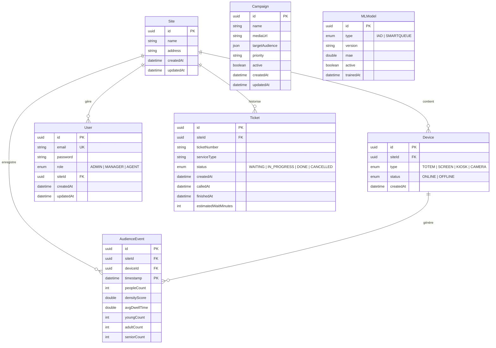

# Spécification du Schéma de Base de Données

Ce document décrit en détail la structure de la base de données PostgreSQL + TimescaleDB pour le projet **IAD & SmartQueue AI**.

## 1. Diagramme Entité-Association (ERD)

---

## 2. Description des Tables

### 2.1. `sites` (Site)
Représente un établissement physique équipé du système d'affichage et de détection.
- **id** (`UUID`): Identifiant unique global.
- **name** (`TEXT`): Nom de l'établissement.
- **address** (`TEXT`): Adresse postale complète.
- **createdAt / updatedAt** (`TIMESTAMP`): Métadonnées de suivi temporel.

### 2.2. `devices` (Périphérique)
Matériel déployé sur site (borne tactile, écran d'affichage publicitaire, caméra intelligente).
- **id** (`UUID`): Identifiant du périphérique.
- **siteId** (`UUID`): Clé étrangère pointant vers `sites(id)`.
- **type** (`DeviceType`): Type de matériel (`TOTEM`, `SCREEN`, `KIOSK`, `CAMERA`).
- **status** (`DeviceStatus`): Statut opérationnel actuel (`ONLINE`, `OFFLINE`).

### 2.3. `users` (Utilisateurs & Agents)
Compte utilisateur permettant de s'authentifier sur le tableau de bord ou les outils d'administration.
- **id** (`UUID`): Identifiant unique.
- **email** (`TEXT`, Unique): Adresse email de connexion.
- **password** (`TEXT`): Empreinte du mot de passe hashée de manière sécurisée avec bcryptjs (12 rounds).
- **role** (`UserRole`): Privilèges RBAC (`ADMIN`, `MANAGER`, `AGENT`).
- **siteId** (`UUID`, Nullable): Site auquel l'utilisateur est affecté.

### 2.4. `campaigns` (Campagnes d'affichage)
Publicités ou informations planifiées pour l'affichage ciblé.
- **id** (`UUID`): Identifiant unique.
- **name** (`TEXT`): Nom de la campagne.
- **mediaUrl** (`TEXT`): Lien absolu vers le média ou la vidéo stockée dans MinIO.
- **targetAudience** (`JSONB`): Critères de ciblage démographique (ex. tranches d'âge, genre).
- **priority** (`TEXT`): Priorité de diffusion.
- **active** (`BOOLEAN`): Statut d'activation de la campagne.

### 2.5. `audience_events` (Événements de détection)
Table de données temporelles d'analyse d'audience. **Cette table est configurée comme Hypertable TimescaleDB.**
- **id** (`UUID`): Identifiant de l'événement.
- **siteId / deviceId** (`UUID`): Références géographiques et matérielles.
- **timestamp** (`TIMESTAMP`): Instant exact de la mesure (Axe de partitionnement TimescaleDB).
- **peopleCount** (`INT`): Nombre total de personnes détectées simultanément.
- **densityScore** (`DOUBLE`): Densité de la foule.
- **avgDwellTime** (`DOUBLE`): Temps d'attention / de passage moyen en secondes.
- **youngCount / adultCount / seniorCount** (`INT`): Répartition par tranche d'âge estimée.

### 2.6. `tickets` (Tickets de file d'attente)
Tickets physiques émis depuis les kiosques de tickets.
- **id** (`UUID`): Identifiant unique.
- **siteId** (`UUID`): Référence de l'établissement.
- **ticketNumber** (`TEXT`): Numéro séquentiel affiché (ex: A-102).
- **serviceType** (`TEXT`): Type de service demandé (ex: consultation, facturation).
- **status** (`TicketStatus`): État du ticket (`WAITING`, `IN_PROGRESS`, `DONE`, `CANCELLED`).
- **createdAt / calledAt / finishedAt** (`TIMESTAMP`): Suivi précis de la prise en charge.

---

## 3. Optimisations & Indexation

### Index configurés :
- `users(email)`: Index Unique pour une authentification performante.
- `devices(siteId)`: Optimise la récupération des matériels d'un site.
- `audience_events(siteId)`, `audience_events(deviceId)`: Permet de filtrer l'audience par caméra ou établissement.
- `audience_events(timestamp)`: Améliore grandement les requêtes analytiques sur fenêtres temporelles.
- `tickets(siteId)`, `tickets(status)`: Optimise le calcul du temps d'attente en temps réel pour une file d'attente donnée.

### Optimisation TimescaleDB :
- La table `audience_events` utilise une **clé primaire composite** `(id, timestamp)` pour répondre aux exigences strictes de TimescaleDB, garantissant l'unicité au sein des partitions (chunks) basées sur le temps.
- Partitionnement temporel automatique via `create_hypertable` avec intervalle par défaut de 7 jours.
