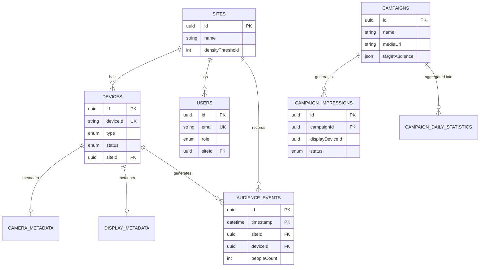

# Diagramme ERD (Mermaid)

```mermaid
erDiagram
    SITES {
        uuid id PK
        string name
        int densityThreshold
    }
    
    DEVICES {
        uuid id PK
        string deviceId UK
        enum type
        enum status
        uuid siteId FK
    }

    USERS {
        uuid id PK
        string email UK
        enum role
        uuid siteId FK
    }

    AUDIENCE_EVENTS {
        uuid id PK
        datetime timestamp PK
        uuid siteId FK
        uuid deviceId FK
        int peopleCount
    }

    CAMPAIGNS {
        uuid id PK
        string name
        string mediaUrl
        json targetAudience
    }

    CAMPAIGN_IMPRESSIONS {
        uuid id PK
        uuid campaignId FK
        uuid displayDeviceId
        enum status
    }

    SITES ||--o{ DEVICES : "has"
    SITES ||--o{ USERS : "has"
    SITES ||--o{ AUDIENCE_EVENTS : "records"

    DEVICES ||--o| CAMERA_METADATA : "metadata"
    DEVICES ||--o| DISPLAY_METADATA : "metadata"
    DEVICES ||--o{ AUDIENCE_EVENTS : "generates"

    CAMPAIGNS ||--o{ CAMPAIGN_IMPRESSIONS : "generates"
    CAMPAIGNS ||--o{ CAMPAIGN_DAILY_STATISTICS : "aggregated into"
```
