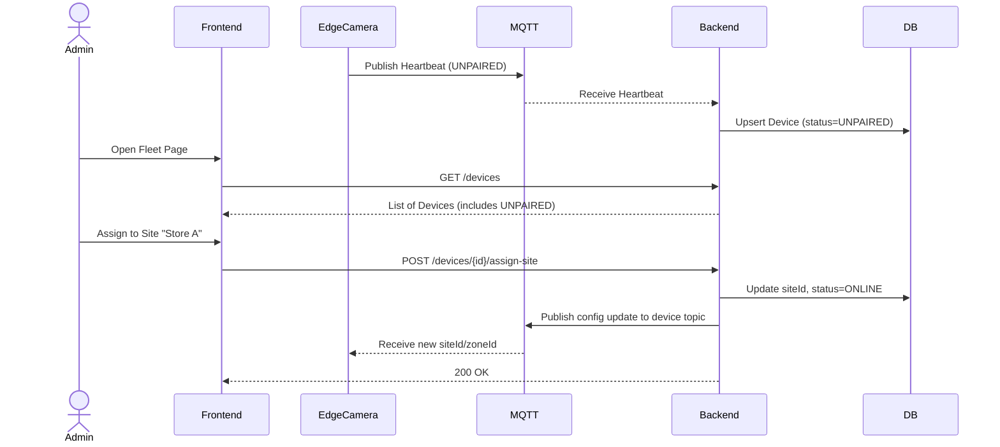
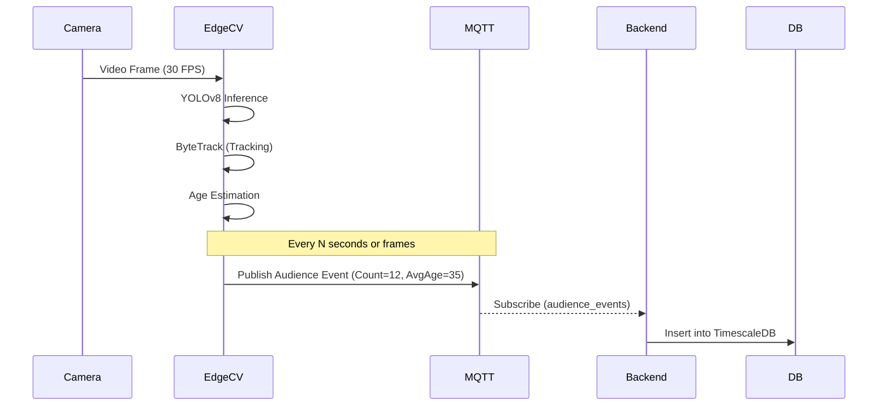

# Diagrammes de Séquences (Mermaid)

### Découverte et Appairage d'un Appareil

```mermaid
sequenceDiagram
    actor Admin
    participant Frontend
    participant EdgeCamera
    participant MQTT
    participant Backend
    participant DB

    EdgeCamera->>MQTT: Publish Heartbeat (UNPAIRED)
    MQTT-->>Backend: Receive Heartbeat
    Backend->>DB: Upsert Device (status=UNPAIRED)
    
    Admin->>Frontend: Open Fleet Page
    Frontend->>Backend: GET /devices
    Backend-->>Frontend: List of Devices (includes UNPAIRED)
    
    Admin->>Frontend: Assign to Site "Store A"
    Frontend->>Backend: POST /devices/{id}/assign-site
    Backend->>DB: Update siteId, status=ONLINE
    Backend->>MQTT: Publish config update to device topic
    MQTT-->>EdgeCamera: Receive new siteId/zoneId
    Backend-->>Frontend: 200 OK
```

### Inférence et Analytics

```mermaid
sequenceDiagram
    participant Camera
    participant EdgeCV
    participant MQTT
    participant Backend
    participant DB

    Camera->>EdgeCV: Video Frame (30 FPS)
    EdgeCV->>EdgeCV: YOLOv8 Inference
    EdgeCV->>EdgeCV: ByteTrack (Tracking)
    EdgeCV->>EdgeCV: Age Estimation
    
    Note over EdgeCV,MQTT: Every N seconds or frames
    EdgeCV->>MQTT: Publish Audience Event (Count=12, AvgAge=35)
    
    MQTT-->>Backend: Subscribe (audience_events)
    Backend->>DB: Insert into TimescaleDB
```
